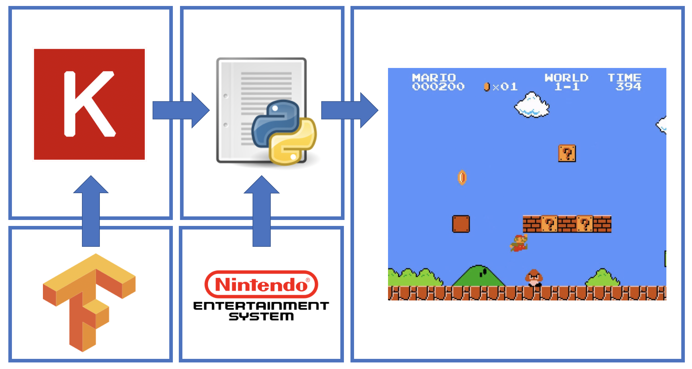

# 중간보고서

## Abstract

 본 연구의 목적은 강화학습 기법을 사용해 임의의 게임 환경에서 목표를 완수할 수 있는 구현체를 제작하는 것이다. 구현의 토대는 구글사의 기계학습 프레임워크 텐서플로우를 사용했으며, 사용한 언어는 파이썬이다. 강화학습 알고리즘으로는 심층 큐 신경망과 비동기적 우위 행동-평가 알고리즘을 선택하였다. 기존의 구현은 대체로 하나의 게임을 분석해 에이전트와 행동반경, 그리고 장애물 등을 분류하여 최적 해를 구하는 방식이었으나, 본 연구에서는 게임 환경 자체를 정지된 화면의 연속으로 파악해 일련의 상황에 대한 보상을 계산하고 해당 장면으로 넘어갈 수 있는 동작을 수행하도록 구현하였다. 이를 통해 기존의 게임 플레이 에이전트가 갖고 있던 도메인의 한계를 극복하고, 화면의 비트맵만 전달할 수 있다면 어떠한 종류의 게임도 학습할 수 있는 일반 알고리즘을 구현하고자 하였다.

## 서론

### 제안배경 및 필요성

 “인공지능은 새 시대의 전기(電氣)다.” 앤드류 응 박사의 말처럼, 인공지능은 시대의 화두가 되었다. 현재 2.0을 맞이하며 가장 널리 쓰이고 있는 기계학습 프레임워크 텐서플로우는 4,100만회 이상 다운로드 되었으며, 최근 2019년 3월 6일과 7일에 걸쳐 개최된 Tensorflow Dev Summit에는 천명 이상의 전문가와 애호가, 그리고 수만명 이상의 중계 시청자가 참여했다. 알파고 이후 단순히 인공지능에 대한 환상 혹은 추상적인 의제설정을 넘어, 실제 모델을 구현하고 개발해 사용하는 시대가 된 것이다. 연구소, 대기업은 물론이고, 사회 초년생들의 스타트업, 심지어 중-고교에서까지 인공지능을 이야기하고, 그것을 통해 상상을 구현하고 있다.

 최근 컴퓨터의 연산력 증대와 함께 널리 쓰이고 있는 강화학습은 이런 흐름을 더욱 가속화한다. 기존의 방법론이 규칙을 설정한 이후 그 정해진 규칙을 수행하는 일에 국한되어 있었다면, 강화학습 및 딥러닝은 그 한계를 넘어 명확한 규칙이 없는 상황에서도 보상함수를 따라 기계가 학습해 결과를 낼 수 있는 구조를 만들었다. 분야의 제한 또한 거의 없어, 영상인식, 자연어 처리, 혹은 투자 등 다양한 지점에서 인공지능이 만들어지고 있다.

 많은 사례 가운데 본 연구에서 채택한 것은 게임에 적용하는 모델이다. 본디 게임이라는 것은 한정된 상태에서 한정된 선택지로 특정한 목적을 이루는 것이다. 이런 특성상 알파고 이전의 게임 인공지능들은 모든 경우의 수를 저장한 뒤, 최적 값을 빠르게 찾는 경로탐색 알고리즘에 가까웠다. 그러나 실제 게임을 해보면, 유한한 경우의 수라 해도 모든 경우의 수를 따지는 것은 사실상 불가능한 일에 가깝다. 현대시대의 게임의 경우의 수는 상상할 수 없을 만큼 많고, 이것에 대한 모든 경우의 수를 계산해 최적 해를 찾는 것은 지금의 하드웨어로도 불가능에 가까운 일이다.

 바둑의 예시가 대표적으로, 바둑판 위에서 가능한 모든 수를 계산하는 것은 불가능하다. 체스가 완벽하게 파훼된 것과 대조적으로, 이런 이유 때문에 아무리 컴퓨터가 우수해도 바둑에서 사람을 이기는 것은 불가능하다는 말이 자주 나왔다. 그러나 우리가 알파고를 통해 확인한 것은, 이런 전체 경우의 수를 계산하는 것이 아닌 인간과 유사한 방식으로 ‘학습’하는 알고리즘이 성취를 이뤄낼 수 있다는 사실이었다. 실제 알파고는 이세돌과 커제를 꺾음으로서 그 성능을 증명했고, 이후 새로운 방식으로 구현된 알파고 제로는 이 알파고와 상대로도 전승을 했다고 알려져 있다.

 이런 성취를 이뤘음에도 불구하고, 다른 분야에 비해 게임 인공지능은 낮은 수준에 머물러있다. 그 기저에는 세 가지 요소가 있는데, 하나는 기존 규칙 기반 인공지능이 이미 도입된 상태기에 바꾸기 어렵다는 점, 다른 하나는 강화학습 기반의 인공지능은 막대한 연산력이 필요해 규모가 큰 다목적 게임에서 처리하기 어렵다는 점, 그리고 마지막으로 그 잠재력을 아직 사람들이 인지하지 못한다는 점이다.

 그렇다면 게임 인공지능은 왜 필요한가? 게임의 정의를 다시 생각해보면, 게임 상황을 해결하고 목적을 달성할 수 있는 인공지능은 게임의 일반해를 구하는 과정이라 볼 수 있다. 즉, 게임 인공지능은 특정 상황과 보상함수, 그리고 환경의 정보가 입력되었을 때 하나의 해결책을 제시할 수 있고, 이것은 현재 답이 없다고 알려진 문제들이나 경우의 수를 쉽게 고려하기 어려운 문제들에 대해 하나의 지침을 제공한다. 또한 단순히 지침을 제공할 뿐만 아니라, 더 많은 정보와 시간을 주었을 때 더욱 최적 해에 가까운 답을 내놓을 수도 있다. 이런 문제들에 대한 기존 해법이 인간의 경험적 판단이었음을 미루어 볼 때, 컴퓨터의 ‘학습’을 통한 새로운 판단은 시간대비 효율이 우수할 것이라 예상해볼 수 있다.

 단순히 그 확장성뿐만 아니라, 학습하고 수행할 수 있는 게임 인공지능이 게임 산업 전반에 미칠 영향도 기대할만하다. 게임이란 장르의 핵심적 요소는 언제 어디서든 기기만 있으면 플레이할 수 있다는 점에 있다. 이때, 각자의 시공간이 다르므로 시간이 흐를수록 같이 게임을 하기는 어려워진다. 그럴 때 보통 인공지능과 상대를 하게 되는데, 기존의 인공지능들과 상대를 할 경우 몇 번의 시행 이후에는 인공지능의 패턴을 학습해, 특정 패턴으로 인공지능이 잘못된 수를 두도록 유도하거나 인공지능이 인식하지 못하는 수를 둠으로써 승리하는 ‘크랙’ 혹은 ‘치팅’ 방식이 존재했다.

 뿐만 아니라 대규모 접속 게임의 경우, 제대로 유저로서 기능을 수행하지 못하고 자원만 고갈시키는 ‘봇’의 존재로 인해 사용자 경험이 현저하게 저해되는 현상이 자주 발생한다. 정해진 규칙에 의해 프로그래밍 된 기존의 에이전트는 학습은커녕 ‘상호작용’ 자체가 불가능하고, 이런 에이전트들은 실제 사용자들에게 불쾌감과 위화감을 조성한다. 그에 비해 학습이 가능한 인공지능은 환경 내에서의 모든 요소에 대해 학습 및 반응을 할 수 있고, 추후 자연어 처리와 같은 다른 기법과 융합해 보다 실제 사용자에 가까운 모습을 연출할 수 있다.

 지금까지 연구 결과의 의의를 살펴보았다면, 이제 과정의 의의를 살펴보자. 앞서 살펴본 바와 같이 현재의 게임 인공지능은 정해진 규칙을 수행하는 형태가 많다. 본 연구의 방법론은 이런 규칙이 아닌, 단순히 진행도에 따른 보상과 페널티를 부여하는 보상함수와 화면 정보를 통한 강화학습이다. 이 방식의 특장점은 환경의 종류에 상관없이 화면 데이터를 통해 학습이 가능하다는 점이다. 기존의 방식은 대부분의 특징을 엄밀히 규정해야 했고, 그에 따른 분류 계층이 포함되었다. 반면 본 연구의 방식은 그런 분류를 하지 않는 각각의 화면 자체의 값을 평가하고, 이러한 추상화를 통해 학습된 모델을 다른 플랫폼에도 바로 적용할 수 있도록 하였다.

 이에 더하여 본 연구의 지향은 게임 내에 존재할 수 있는 다양한 객체에 인공지능을 적용하는 것으로, 실제 상용 게임 안에는 수백-수만의 객체가 존재하기 때문에 각 모델이 학습하기 위해선 연산의 최적화가 절실하다. 현재 강화학습 평가의 주된 평가는 높은 정확도에 있지만, 본 연구에서는 학습에 필요한 자원 및 시간 또한 면밀히 고려하고자 하였다. 아래에 보다 자세히 설명하겠지만, 심층 큐 신경망의 학습속도를 개선한 비동기적 우위 행동-평가 모델을 채용해 보급형 CPU로도 학습을 진행할 수 있게 되었다.

 연구의 학습 도메인은 닌텐도사의 게임 ‘슈퍼 마리오 브라더스’로, 채택 배경은 다음과 같다. 하나는 게임의 내용이 어렵지 않다는 점이다. 강화학습의 특성상 보상함수의 반환 값을 계산할 수 없으면 학습이 이루어지지 않기 때문에 적당한 난이도의 게임을 고르고자 했다. 다른 하나는 게임의 화면 데이터를 파이썬으로 내보낼 수 있는 라이브러리가 존재한다는 점이다. 상용 게임의 화면을 렌더링 이전 데이터로 출력하는 것은 리버스 엔지니어링에 가깝고, 연구의 목적과는 조금 거리가 있는 일이다. 따라서 이미 해당 내용을 진행할 수 있는 라이브러리가 있는 게임을 선택했다.

### 작품의 목표

 처음 작품의 목표는 전략 시뮬레이션 게임을 플레이하는 에이전트를 만드는 것이었다. 그렇기 때문에 고전게임 스타크래프트1에서 플레이할 수 있는 에이전트 BWAPI를 연구했다. 그러나 그 과정에서는 몇 가지 한계가 있었다. 첫째는 해당 라이브러리가 정식 인가를 받지 못한 연구용 라이브러리였다는 것이다. 연구 도중 ‘스타크래프트 리마스터’가 출시되면서, BWAPI는 코드 전반을 뜯어 고쳐야 실행할 수 있는 라이브러리가 되었고, 구버전 스타크래프트를 구하는 합법적인 방법은 찾기 어려웠다. 둘째로, 해당 라이브러리 및 게임의 구조가 도메인 한정적이었다는 점이다. 기본적으로 BWAPI는 전략의 집합을 설정하고, 그 중 가장 이길 확률이 높은 전략을 계산해서 경로를 탐색하는 방식의 인공지능이었다. 해당 방식은 일반 해를 구하고자 하는 연구의 방향성과 맞지 않는 부분이 많았다. 

 옮긴 주제는 스타크래프트2였다. 스타크래프트2는 블리자드사와 딥마인드사간의 협력으로 PySC2라는 공식 라이브러리를 제공했다. 또한 라이브러리 자체도 순수하게 에이전트의 행동만 분리해둔 계층으로, 강화학습을 시도하기에 적합한 플랫폼이었다. 그러나 연구를 진행하다보니, 현재 여건으로 시도하기에는 몇가지 어려움이 있었다. 먼저 학습 난이도가 매우 높다는 점이다. 일반적으로 사람도 어려워하는 게임인 스타크래프트2의 경우 일정한 성취를 위해 필요한 분당 행동수가 300회 이상으로 알려져 있고, 정보 또한 불완전하며 경우의 수가 무한한 환경이다. 또한 그렇기 때문에 학습을 위해서는 고성능의 컴퓨팅 자원이 필요하다. 따라서 여건상 플랫폼을 선택하기 어렵다고 판단했다.

 결국 최종적으로 정해진 연구의 학습 도메인은 닌텐도사의 게임 ‘슈퍼 마리오 브라더스’로, 채택 배경은 다음과 같다. 하나는 게임의 내용이 어렵지 않다는 점이다. 강화학습의 특성상 보상함수의 반환 값을 계산할 수 없으면 학습이 이루어지지 않기 때문에 적당한 난이도의 게임을 고르고자 했다. 다른 하나는 게임의 화면 데이터를 파이썬으로 내보낼 수 있는 라이브러리가 존재한다는 점이다. 상용 게임의 화면을 렌더링 이전 데이터로 출력하는 것은 리버스 엔지니어링에 가깝고, 연구의 목적과는 조금 거리가 있는 일이다. 따라서 이미 해당 내용을 진행할 수 있는 라이브러리가 있는 게임을 선택했다.

 작품의 기본적인 목표는 상술한 슈퍼 마리오 브라더스 게임의 스테이지 1-1을 완수하는 것이다. 적절한 난이도의 플랫포머 게임을 클리어하는 과정을 통해 인공지능은 ‘게임’에 대한 개념을 습득하고, 추후 추가적인 스테이지 클리어 및 다른 게임에도 적용하는 것을 기대해볼 수 있다. 

 보다 세부적으로 목표를 설명하자면, 에이전트와 환경 객체들의 분류를 화면 데이터의 변화에 따른 보상함수 출력값의 변경만을 통해 계산하는 것이다. 실제 슈퍼 마리오 브라더스라는 게임을 살펴보면, 다양한 문제가 있음을 확인할 수 있다. 경로를 방해하는 장애물이 있으며, 닿으면 죽는 객체도 있다. 닿으면 죽는 객체 중에서도 몬스터가 있고, 흔히 탄막(Sprite)이라 불리는 파티클도 있다. 본 연구에서는 이런 정보가 에이전트에게 따로 주어지지 않고, 오직 화면과 결과값의 보상 합계를 통해 에이전트의 행동이 결정된다.

 이 방식을 채택한 이유는 ‘과연 사람은 어떻게 게임을 하는가?’ 라는 질문에 대한 대답이기 때문이다. 실제 게임을 플레이할 때, 프로그래머 혹은 게임업계 종사자가 아닌 이상 객체 각각을 분석하고 경우의 수를 계산하는 사람은 거의 없다. 실제 사람이 게임을 할 때는 게임 화면만이 주어지는 정보로, 그 화면 자체의 변화를 보고 자신의 게임 결과를 판단하다. 즉, 장애물이 있기 때문에 지나가지 못하는 것이 아니라, 지나가지 못하기 때문에 장애물임을 알게 되는 것이다. 따라서 우리의 목표는 이렇게 인간의 학습방식과 가깝게 화면 정보 전체만을 통해서 게임을 클리어할 수 있는 에이전트를 만드는 것이다.

### 작품 전체 Overview

 먼저 작품 전체의 구조를 간단한 다이어그램으로 살펴보자.

 구조는 크게 학습 프레임워크, NES 모듈, 파이썬 스크립트, 그리고 출력 화면으로 나누어진다. 자세한 설명은 구현에서 덧붙이고, 가벼운 개관을 살펴보도록 하겠다. 다시 한 번 작품을 정의하자면, 신경망 강화학습을 통해 슈퍼마리오 브라더스 게임을 완수할 수 있는 에이전트다. 따라서 크게 세 가지 과정을 따라가야 하는데, 첫째는 게임의 그래픽 정보를 받는 전처리 과정, 둘째는 게임을 실제 학습하며 플레이하는 강화학습 과정, 그리고 마지막은 그 플레이한 결과를 출력하는 과정이다. 

 전처리와 출력에 사용되는 모듈이 NES-Py로, 닌텐도 엔터테인먼트 시스템 게임들을 파이썬으로 구현한 라이브러리다. 해당 라이브러리를 통해 슈퍼마리오 게임의 화면 및 행동 반경을 파이썬 코드로 받아오거나 내보낼 수 있다. 비슷한 구현체로는 FCEUX가 있는데, 해당 구현체를 사용하기 위해서는 Lua API를 작성해야하므로 일관된 파이썬 환경을 조성하고자 NES-Py를 채택했다.

 강화학습을 위한 프레임워크로는 텐서플로우를 채택하였다. 실제 기계학습 프레임워크는 매우 다양한 종류가 있다. 카페, 토치, CNTK, 테아노 등 수많은 프레임워크가 있지만, 본 작품에서는 텐서플로우를 채택하였다. 이유는 높은 확장성과 활발한 커뮤니티로, 관련 커뮤니티 중 하나인 페이스북 그룹 텐서플로우 코리아는 각 AI대학원의 공고가 꾸준히 기재될 만큼 크고 활발한 기계학습 커뮤니티다. 또한 텐서플로우는 구글이 자체적으로 제공하는 문서와 각종 학습 자료도 충분히 마련되어있어, 여타 프레임워크에 비해 학습 곡선도 완만한 편이다.

 코드 가독성과 간결성, 그리고 모듈화를 위하여 케라스 API를 채택하였다. 케라스는 텐서플로우를 위한 훌륭한 API를 제공하며, 최근 발표한 텐서플로우 2.0에서는 케라스가 텐서플로우의 공식 라이브러리 중 하나로 채택되었다. 

 마지막으로 위 모든 코드의 작성을 파이썬 스크립트에 담았다. 파이썬을 선택한 이유는 가장 간결하고 직관적인 문법을 가지고 있으며, 상황에 따라 어떤 방식으로든 프로그래밍할 수 있는 유동성을 제공하기 때문이다. 또한 텐서플로우를 포함해서 넘파이, 판다스등 수치/데이터 관련 작업등을 편리하게 해주는 다양한 프레임워크/라이브러리가 있다는 장점이 있다.

 현재 에이전트를 움직이고, 임의의 행동을 하며 진척도를 쌓게 하는데 성공하였다. 그러나 몇몇 큰 장애물에서 에이전트가 고착상태에 빠지는 일이 종종 일어나는데, 이에 대한 해결법으로 환경 조절 및 연산 최적화를 고려하고 있다. 이후 작품 소개 항목에서 각각에 대한 더욱 자세한 구조 설명 및 적용 알고리즘, 상호간의 코드 의존성 등을 설명하겠다.

## 관련 연구

 행동반경이 한정된 게임은 강화학습으로 적절한 인공지능을 만들 수 있다[1]. 무작위로 에이전트가 행동하게 하는 인공지능보다 훨씬 높은 수준의 성과를 보일 수 있으나, 행동반경이 확장될 때마다 시행착오가 늘어나는 문제가 있었다. 실제 상용 게임일수록 더욱 고도화된 환경임을 감안하면, 아직 부족한 단계였다고 볼 수 있다. 이후 게임 알고리즘의 대표적인 예시는 A* 알고리즘을 기반으로 한 경로 탐색 문제가 되었다[2]. 이런 과정 속에서 최적화를 위해 단층 퍼셉트론을 적용하기도 하는 등, 조금씩 신경망 학습과 강화학습을 융합하는 연구가 진행되었다. 한편 다른 갈래에서는, 알고리즘의 최적화뿐만이 아니라 입력값 자체를 단순화하는 연구가 진행되었다[3]. 인지과학적 접근인 합성곱 신경망 또한 복잡한 입력값을 입력으로 받아 학습을 진행하는 방식이었다.

 2015년 네이쳐에 심층 강화학습을 통한 인간 수준의 제어[4]라는 연구가 게재되었다. 딥마인드사에 의해 진행된 이 연구는 실제 인간에 준하는 수준의 실력으로 아타리 2600이라 불리는 가정용 게임기의 여러 게임을 완수하는데 성공했다. 기존에도 심층 신경망 연구와 강화학습 연구는 있었으나, 이 심층 큐 학습(이하 DQN)이 여타 연구와 달랐던 점은 기존의 도메인 한정 학습에서 벗어나 일반 인공지능을 구현하고자 한 점이다. 또한, 그 목표를 위해 생물학적 학습의 방식을 도입했다는 의의가 있다.

 아타리 2600이 한국 사람에게는 낯설고 그 성취를 파악하기 어렵다면, 2016년 3월, 온 나라가 인공지능으로 떠들썩해지는 연구가 등장했다. 바로 알파고[5]였다. 정적 스포츠에서 국기로 꼽을 수 있는 바둑, 그리고 그 중에서도 한국 바둑 역사상 가장 천재적으로 둔다고 평가받던 이세돌과 인공지능의 대국은 세간의 관심을 끌기에 충분했다. 그리고 놀랍게도, 결과는 4:1로 이세돌의 패배였다. 이때 사용된 기술은 흔히 몬테 카를로 트리 탐색(이하 MCTS)라 부르는 알고리즘과 DQN의 혼합이었다. 

 이전까지 게임을 수행할 수 있는 알고리즘 대부분은 의사 결정 트리를 탐색하는 방식이었다. 그러나 이런 방식은, 전체 경우의 수가 많아질 경우 거의 불가능에 가까운 탐색 속도를 갖고 있었다. 최소-최대 트리, 알파-베타 가지치기 등 다양한 기법이 있었으나, 바둑의 수를 읽을 수는 없었다. 반면 MCTS는 정책 기반 임의 선택으로, 정책만 적절히 선택된다면 훨씬 빠른 시간 내에 우수한 해를 구할 수 있다. 이때 이 정책을 효율적으로 설정하는 것이 큐 학습이고, 그 큐 학습을 검증된 수준까지 끌어올린 것이 이전의 연구였으며, 알파고의 승리였다. 또한 하드웨어 병렬 프로그래밍의 수준도 무시할 수 없는데, 알파고의 경우 학습을 위해 1000개 이상의 CPU와 100개 이상의 GPU를 사용했다[6]. 

 반면 심층학습이지만 마르코프를 도입하지 않고 미니맥스 트리기법을 응용한 방식도 있었는데, 그것이 생성-적대 신경망(이하 GAN)이다[7]. 쉽게 예를 들어, 해커와 보안회사가 있다고 생각해보자. 시스템이 있을 때, 해커는 침투하는 방법을 찾을 것이다. 그렇다면 보안회사는 해커가 침투할 수 없게 방어기전을 만들 것이다. 그 방어기전을 보면 다시 해커는 뚫는 방법을 고안하고, 이 패턴이 계속 반복되면 결국 강한 시스템을 구축할 수 있다. 실제 분류 문제와 자연어 처리에서 GAN은 뛰어난 성능을 보이고 있다.

 마지막으로, 딥마인드에서 2016년에 발표한 비동기적 우위 행동-평가 모델(이하 A3C)이 있다[8]. 기존 DQN의 문제점은 자원 의존도였다. 연산 요구치가 극도로 높았기 때문에 고가의 장비가 필요했고, 그 고가의 장비로 오랜 시간 학습을 해야 해 비용 또한 컸다. A3C는 이러한 구조를 학습 자체의 병렬화를 통해 개선하였다. 실제 2014년과 같은 아타리 2600을 플레이 했을 때, 기존의 DQN이 많은 GPU 및 시간을 요구했다면 A3C의 경우 보급형 CPU로도 DQN보다 짧은 시간동안 같거나 높은 성취를 보이는데 성공했다.

 논문뿐만 아니라 다양한 환경 및 프로젝트, 그리고 서적들도 만들어지고 있다. 대표적으로 Open AI에서 진행하는 Gym 프로젝트[9]가 있다. Gym은 문자 그대로 체육관으로, 인공지능들이 훈련할 수 있는 학습 데이터, 그리고 다른 인공지능과 성능 차이를 비교할 수 있는 순위 등을 제공한다. 단순히 시스템 제공뿐만 아니라, Gym을 통해 게임-인공지능 간 인터페이스를 만들 수도 있다. 실제 본 작품과 관련된 프로젝트로, Gym을 통해 슈퍼마리오 플레이 환경을 만든 Gym-super-mario-bros[10]가 있다. 그 외에도 다음 프로젝트들[11][12][13]이 있다. 또 위의 연구들을 더 쉽게 제공하고자 하는 해설서도 다양하게 만들어지고 있다.

## 제안 작품 소개

## 구현 및 결과분석

## 결론 및 소감

구제성

 처음 작품을 시작할 때는 아무것도 아는 게 없었다. 인공지능, 기계학습, 그리고 심층학습의 차이도 명확하게 구분하지 못했고, 프로그래밍 언어도 C, C++밖에 사용하지 못했다. 무작정 BWAPI를 뜯어보며 구조가 어떻게 되어있는지, 게임 인공지능이 무슨 의미인지 조금씩 알아갔다. 교수님이 PySC2를 주셨을 때는 눈앞이 막막했다. 지금껏 써보지 않은 파이썬을 사용해야 했고, 프로젝트의 규모도 일일이 확인할 수 있는 수준이 아니었다. 그뿐 아니라 수학적 요구치도 높았다. BWAPI를 작업할 때는 여러 가능한 전략의 집합 중 최적 전략을 뽑아내는 단순한 경로 탐색 문제였다면, 강화학습은 처음 모델 설계부터 수학적, 이론적 기반이 필요했다.

 처음엔 도저히 할 수 없는 일이라는 생각이 들었다. 차근차근 수학을 공부하고, 이해가 되지 않는 과목들은 재수강을 해가며 내실을 다졌어야 했는데, 그러지 못한 자신이 부끄러웠다. 도대체 어떻게 어디서부터 시작해야할까 고민하며 졸업 작품을 멀리했다. 그렇게 기약 없는 시간을 보내던 무렵, 친구들이 모인 자리에서 졸업 작품 이야기를 털어놓았다. 그러자 한 친구가 관심을 보였다. 자신도 그 주제에 흥미가 있는데, 같이 하는 게 어떠하냐는 제안이었다. 믿을 수 없는 행운이었다. 심지어 원래 작품을 진행하고 있었고, 나랑 같이 하게 되면 한 학기가 밀리는데도 선뜻 함께해주었다.

 같이하는 사람이 있다는 것은, 지친 순간에 의지할 수 있는 사람이 있다는 것이다. 괜찮다고 말해주고, 같이 열심히 하자고 말해주는 친구가 있으니 뭐든 할 수 있겠다는 생각이 들었다. 마음을 다잡고 처음부터 시작했다. 복수전공생인 나는 수리적 기초가 부족했기 때문에 수학부터 다시보기 시작했다. 수학의 정석을 다시 폈고, 인공지능을 위한 수학책을 사서 읽었다. 개론서도 열심히 사서 읽었다. 교수님이 추천해주신 밑바닥부터 시작하는 딥러닝으로 시작해서, 핸즈온 머신러닝, 러닝 텐서플로, 그리고 파이썬과 케라스로 배우는 강화학습등 시중의 유명한 서적을 찾아 읽어보았다. 평생 쳐다도 안봤던 인터넷 강의자료와 MOOC도 끙끙대며 들었다.

 그럼에도 불구하고 인공지능의 벽은 높았다. 만약 지금처럼 좋은 라이브러리와 프레임워크들, 그리고 친구가 있지 않았다면 아마 불가능했을 것이다. 다행히 텐서플로우와 케라스의 힘은 대단했다. 수천 줄을 짜야했을 그래프와 계층 설계를 간단한 함수 형태로 지원해주니 너무 편리했다. 물론 마냥 좋았던 것은 아니다. 실수투성이였고, 도대체 왜 작동하지 않는지 이해할 수 없는 상황도 많았다. 그럴 때마다 깃헙과 스택오버플로우 등 커뮤니티, 그리고 각 프레임워크들의 공식 문서가 큰 도움이 되었다. 문서화의 중요성을 실감했고, 이미 다른 사람들이 이뤄놓은 성과를 학습하는 것이 스스로의 창발성에도 얼마나 큰 도움이 되는지 몸으로 깨달았다. 그 과정 속에서 스스로의 개발 및 연구 과정을 문서화하고, 또 남이 그렇게 정리한 문서를 읽는 습관이 생겼다.

 친구와 꾸준히 같이 작업하면서, 의사소통의 중요성을 뼈저리게 실감했다. 각자가 사정이 있고 투자할 수 있는 시간대가 달랐기 때문에 온라인으로 작업을 많이 했다. 이 과정 속에서 의견의 충돌이 있을 때도 있었고, 서로가 다른 환경에서 작업을 해서 서로의 코드를 각자 컴퓨터에서 실행하지 못하는 경우도 있었다. 이러한 경험을 하면서 가상 환경의 유용함, 형상 관리 시스템의 중요성, 그리고 매뉴얼의 중요성을 체득했다. 그 결과 지금은 서로의 문제에 대해서도 대강 짐작할 수 있게 되었고, 또 어떤 플랫폼에서든지 동일한 작업물을 낼 수 있을 정도의 추상화 능력을 키웠다.

 졸업 작품 전반을 통해 얻은 것이 정말 많다. 지금까지 안일하게 해온 공부에 대해 정신 차리는 계기가 되었으며, 문제가 생겼을 때 그것을 해결하기 위해 여러 가지 방안을 궁리하고 시도해볼 수 있는 힘이 생겼다. 전혀 모르는 일에 대해서도 공부하고 해보면 된다는 마음이 생겼고, 동료와 함께 작업하는 과정에 대해서도 알게 되었다. 그리고 다른 모든 걸 떠나서, 공부 자체가 즐거워졌다. 4학년이 되도록 한 번도 생각해본 일 없는 대학원에 대해서도 생각해보게 되었다. 앞으로 내가 어떤 삶을 살아가게 될지는 모르겠지만, 졸업 작품이 삶에 있어서 큰 분기였다는 점만은 확실하다.

전덕우

 본래 나는 다른 지도교수님 아래서 다른 주제로 졸업작품을 진행하고 있었다. 졸업 작품을 어떤 식으로 진행해야 하는지 몰랐던 나는, 그저 수업을 들었던 교수님들 중에서 기억나던 한 분을 골라 지도 신청을 하였었다. 신청한 뒤에야 그분의 연구 분야가 어떤 것인지, 내 졸업 작품으로 어떤 주제를 할 수 있는지 찾아봤을 정도로 그 당시에는 어떻게 해야 하는지 감이 없었다. 

 교수님의 배려로 관심 있는 주제를 찾아, 그 연구실에서 진행하는 프로젝트와 연결하여 졸업작품을 시작하게 되었지만, 관련 분야의 공부를 전혀 해보지 않은 나로서 그 연구실에서 작품을 진행하는 것은 매우 막막한 일이었다. 해당 연구실의 대학원생의 꾸준한 도움을 받아 진행해 보았지만, 중간보고서 단계에서 교수님이 이런 내용은 졸업 작품으로 인정하기에는 수준이 너무 낮다는 이야기를 하셨고, 그때 그 연구실에서 작품을 진행하기에는 한계를 느끼게 되었다.

 그러던 중 친구의 졸업 작품 이야기를 듣게 되었다. 처음 들었을 때에는 역시나 막막해 보이는 주제였다. 차이가 있다면, 똑같이 막막해 보여도 친구의 주제에는 관심이 있었고, 막막해도 해보고 싶다는 생각이 든다는 것이었다. 그래서 같이 하자는 이야기를 하였고, 다행히 친구도 흔쾌히 수락해 주었다. 비록 기존 작품을 포기해야 했고, 행정상의 이유로 졸업까지 한 학기가 늦어지게 되었지만 이렇게 작품을 진행할 수 있게 되어서 정말 다행이라고 생각한다.

 주제를 좁혀가던 중, 우연히 슈퍼마리오의 스피드런(게임을 최단시간에 완료하는 것) 영상을 보게 되었는데, 출시한지 30년이 넘은 게임에 아직까지 기록이 갱신되고 있다는 것에 놀랐다. 기록은 약 5분가량이었는데, 그 5분에 어떤 기술들이 사용되었는지 설명하는데 30분 가까이 걸리는 것을 보면서, 내가 잘 아는 분야라고 생각했지만 모르는 것이 너무나 많다는 생각을 하게 되었다. 그렇게 슈퍼마리오에 대해서 알아보다가 주제에 적합하다는 생각이 들었고, 논의 끝에 이를 주제로 채택하게 되었다. 그 과정에서, 기존 작품을 진행하면서 공부했던 강화학습과 MDP 등을 접목하는 것이 가능하단 점을 알게 되었고, 기존 작품을 포기하면서 아무것도 남지 않고 시간을 버렸다는 자괴감을 어느 정도 떨쳐낼 수 있었다.

 흥미가 있는 주제라는 점은 큰 동기부여가 되었지만, 그렇다고 모든 과정이 순탄한 것은 아니었다. 부족한 기본지식과 개발경험은 계속 발목을 잡았고, 이는 짧은 시간 만에 극복할 수 있는 문제는 아니었다. 처음엔 막막했지만, 친구한테서 힘을 얻을 수 있었다. 애초에 관련 주제를 졸업 작품 주제로 선택했을 정도로 친구의 열의는 대단했고, 관련 공부는 물론 나는 볼 생각조차 하지 못했던 개발자 커뮤니티들까지 살펴보면서 나에게 가이드라인을 제시해 주었다. 친구의 노력하는 모습을 보면서 나에게 부족한 부분을 채우려는 태도를 배우게 되었고, 짧은 시간 만에 모두 해결할 수는 없어도 앞으로 잘 할 수 있다는 희망을 얻었다. 그리고, 친구는 별 생각 없이 하던 코딩에 대해서도 다시 생각해보는 계기를 주었다. 어떤 기능을 구현하기 위해 3줄 정도로 작성했던 코드가 있는데, 친구가 이를 길이를 절반 가까이 줄이면서도 보다 직관적으로 수정한 것이다. 이를 보면서, 단순히 작동만 하면 된다는 기존의 생각에서, ‘더 좋은 코딩’에 대해서 고민하게 되었다.

 이번 졸업 작품을 진행하면서 많은 것을 배우고 있다. 학업적인 것뿐 아니라, 친구와 같이 개발하는 경험 자체가 값지다는 것을 느끼고 있다. 같이 개발하면서 일어날 수 있는 문제들을 경험하기도 하고, 여러 개발환경을 동시에 사용해보기도 하는 등, 혼자서는 얻을 수 없는 많은 경험들을 얻고 있다. 또한, 학교 수업을 들으면서 지금까지 막연하게 배워온 것들의 조각이 맞춰지는 것을 보면서 신기하기도하고, 왜 더 열심히 하지 않았나 후회스럽기도 하다. 하지만 보기에 힘들어 보이는 일이라도 도전할 수 있는 용기를 얻었고, 미래에 무엇을 하고 싶은지에 대해서도 다시금 고민하게 되었다. 아직은 부족한 점이 많지만, 이를 극복하기 위해서 앞으로도 더욱 노력할 것이다.

## 참고문헌

[1] 강화학습을 이용한 지능형 게임캐릭터의 제어
[2] 게임 캐릭터의 전술적 행동을 위한 위치 평가 함수의 학습
[3]게임을 위한 계층적 상태 기계 기반의 인공지능 LOD
[4] https://storage.googleapis.com/deepmind-media/dqn/DQNNaturePaper.pdf
[5] https://deepmind.com/research/alphago/
[6] AlphaGo의 인공지능 알고리즘 분석 https://www.spri.kr/download/14726
[7] Generative Adversarial Nets
[8] Asynchronous Methods for Deep Reinforcement Learning
[9] https://gym.openai.com/
[10] https://pypi.org/project/gym-super-mario-bros/
[11] http://cs229.stanford.edu/proj2016/report/klein-autonomousmariowithdeepreinforcementlearning-report.pdf
[12] https://github.com/robmsylvester/Super-Mario-Bros-DQN
[13] http://gabegrand.com/files/super_mario_rl.pdf
[14] 밑바닥부터 시작하는 딥러닝

## 소스코드

최상위 경로의 Mario_A3C_DQN.py를 참조하라.
